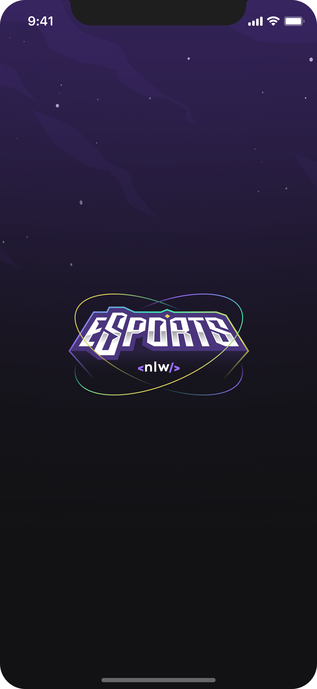
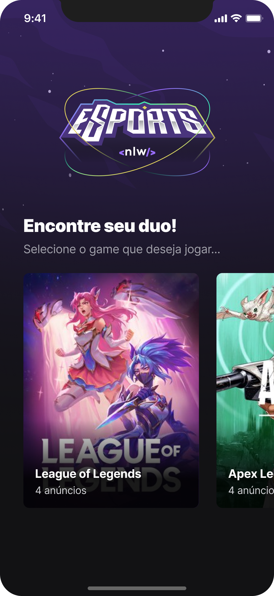
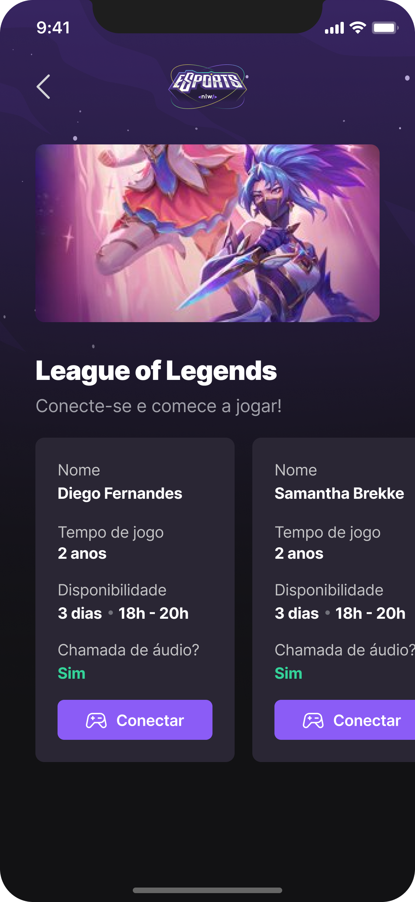
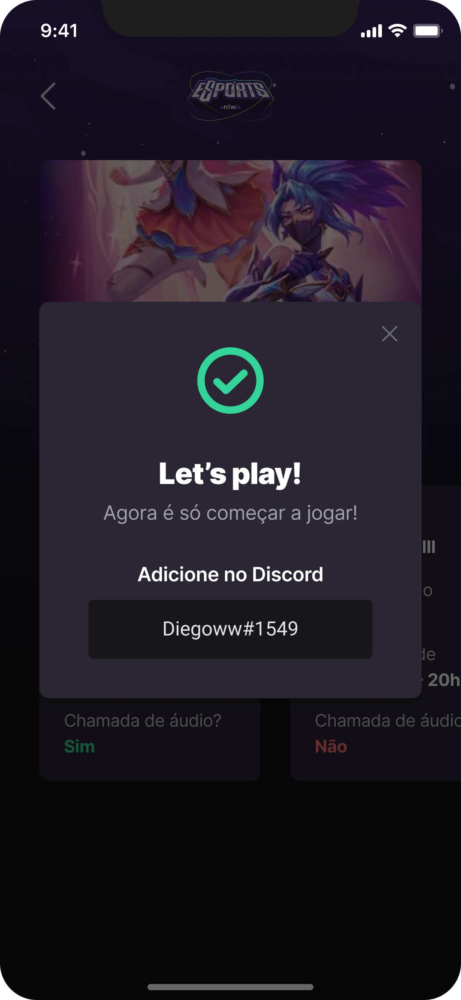

  

---

 Este projeto foi criado na semana NLW da rocketseat.
      

## 📝 Contents

- [Screen Shots](#screen_shots)
- [Built Using](#built_using)

## 🖼️ Screen Shots 

  

  

  

  

## ⛏️ Built Using 

- [Expo](https://expo.dev/) - Ferramenta para desenvolvimento em React-Native
- [React-Native](https://reactnative.dev/) - Framework para desenvolvimento de aplicativos mobile
